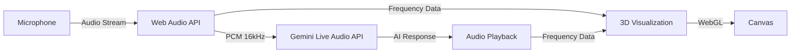

# Orb - Real-time AI Audio Visualization

> **Interactive voice-based AI experience with 3D audio-reactive visualization**

Orb is a real-time interactive audio visualization application that combines Google's Gemini Live Audio API with immersive 3D graphics. Speak to the AI and see your conversation visualized as an animated 3D orb that reacts to audio frequencies in real-time.

[](https://ai.studio/apps/drive/1GB_xnD6NSdY0QfcD1vAVVYgg2gX_oKwP)


---

## Features

- **🎤 Real-time Audio Streaming**: Bidirectional audio communication with Google Gemini AI
- **🌐 3D Visualization**: Audio-reactive 3D orb using Three.js and WebGL shaders
- **🌍 Multi-language Support**: 12 languages with real-time translation
- **📝 Live Transcription**: Speech-to-text for both user input and AI responses
- **🎨 Dynamic Effects**: Custom GLSL shaders with bloom post-processing
- **🌐 Browser-based**: No installation required, runs in modern browsers

---

## Technology Stack

| Layer | Technology | Version |
|-------|------------|---------|
| UI Framework | Lit (Web Components) | 3.3.0 |
| 3D Graphics | Three.js | 0.176.0 |
| AI Integration | @google/genai | 1.15.0 |
| Build Tool | Vite | 6.2.0 |
| Language | TypeScript | 5.8.2 |
| Testing | Vitest | 2.1.8 |
| Runtime APIs | Web Audio API, MediaStream API, WebGL | - |

---

## Quick Start

### Prerequisites

- **Node.js** (v18 or higher recommended)
- **Modern Browser** (Chrome 91+, Firefox 89+, Safari 14.1+, or Edge 91+)
- **Gemini API Key** (get one from [Google AI Studio](https://aistudio.google.com/app/apikey))

### Installation

1. **Clone the repository** (or download the source):
   ```bash
   git clone <repository-url>
   cd Orb
   ```

2. **Install dependencies**:
   ```bash
   npm install
   ```

3. **Set up environment variables**:

   Create a `.env.local` file in the project root:
   ```env
   GEMINI_API_KEY=your_api_key_here
   ```

4. **Start development server**:
   ```bash
   npm run dev
   ```

5. **Open in browser**:

   Navigate to [http://localhost:3000](http://localhost:3000)

---

## Development Commands

| Command | Description |
|---------|-------------|
| `npm run dev` | Start development server with hot reload |
| `npm run build` | Build for production (output to `dist/`) |
| `npm run preview` | Preview production build locally |
| `npm run test` | Run unit tests with Vitest |
| `npm run test:ui` | Run tests with interactive UI |
| `npm run test:coverage` | Generate test coverage report |

---

## Project Structure

```
/home/user/Orb/
├── 📋 Configuration
│   ├── package.json          # Dependencies and scripts
│   ├── tsconfig.json         # TypeScript configuration
│   ├── vite.config.ts        # Vite build configuration
│   ├── metadata.json         # AI Studio metadata
│   └── .gitignore            # Git exclusions
│
├── 🚀 Entry Points
│   ├── index.html            # HTML entry point
│   ├── index.css             # Global styles
│   └── index.tsx             # Main application component
│
├── 🎨 Core Modules
│   ├── visual-3d.ts          # 3D visualization component
│   ├── visual.ts             # 2D canvas visualization (unused)
│   ├── analyser.ts           # Audio frequency analyzer
│   └── utils.ts              # Audio encoding/decoding utilities
│
├── 🎬 Shaders
│   ├── backdrop-shader.ts    # Background gradient GLSL shader
│   └── sphere-shader.ts      # Orb deformation GLSL shader
│
├── 🧪 Tests
│   ├── utils.test.ts         # Audio utilities tests
│   ├── analyser.test.ts      # Analyser class tests
│   ├── sphere-shader.test.ts # Sphere shader validation
│   └── backdrop-shader.test.ts # Backdrop shader validation
│
├── 📦 Assets
│   └── public/
│       └── piz_compressed.exr  # HDR environment map (3.3MB)
│
└── 📖 Documentation
    ├── README.md             # This file
    ├── CLAUDE.md             # AI assistant development guide
    └── SPECIFICATION.md      # Technical specification with UML diagrams
```

---

## How It Works

### Architecture Overview



### Key Components

1. **Main Application (`index.tsx`)**
   - Manages Gemini Live Audio session
   - Handles microphone input and audio playback
   - Processes transcription and language selection
   - Orchestrates visualization component

2. **3D Visualization (`visual-3d.ts`)**
   - Renders audio-reactive 3D orb
   - Custom GLSL shaders for vertex displacement
   - Post-processing with bloom effects
   - HDR environment mapping

3. **Audio Processing (`utils.ts`, `analyser.ts`)**
   - PCM audio encoding/decoding
   - Real-time frequency analysis
   - Audio format conversion (Float32 ↔ Int16)

4. **Shaders (`sphere-shader.ts`, `backdrop-shader.ts`)**
   - Vertex displacement based on audio frequencies
   - Animated gradient background
   - Real-time normal recalculation

---

## Supported Languages

Orb supports real-time translation to the following languages:

- Arabic (العربية)
- Bengali (বাংলা)
- Chinese (中文)
- English
- French (Français)
- German (Deutsch)
- Hindi (हिन्दी)
- Japanese (日本語)
- Korean (한국어)
- Portuguese (Português)
- Russian (Русский)
- Spanish (Español)

Select "None" for parrot mode (AI repeats your speech).

---

## Browser Compatibility

| Browser | Minimum Version | Status |
|---------|----------------|--------|
| Chrome | 91+ | ✅ Full support (recommended) |
| Edge | 91+ | ✅ Full support |
| Safari | 14.1+ | ⚠️ Requires WebKit prefixes |
| Firefox | 89+ | ✅ Full support |
| Mobile Safari | 14.5+ | ⚠️ Performance may vary |
| Chrome Android | 91+ | ✅ Full support |

### Required Browser Features
- ES2022 JavaScript
- Web Components (Custom Elements)
- Web Audio API
- WebGL 2.0
- WebSocket
- MediaStream API (microphone access)

---

## Documentation

- **[SPECIFICATION.md](./SPECIFICATION.md)** - Comprehensive technical specification with:
  - System architecture diagrams (Mermaid)
  - Component diagrams
  - Sequence diagrams for key workflows
  - Class diagrams
  - State diagrams
  - API specifications
  - Performance requirements

- **[CLAUDE.md](./CLAUDE.md)** - AI assistant development guide with:
  - Detailed codebase walkthrough
  - Component deep dives
  - Development workflows
  - Common tasks and troubleshooting
  - Coding conventions

---

## Testing

The project includes comprehensive unit tests for core utilities and components.

### Running Tests

```bash
# Run all tests
npm test

# Run tests with UI
npm run test:ui

# Generate coverage report
npm run test:coverage
```

### Test Coverage

- **Audio Utilities** (`utils.test.ts`): Encoding/decoding, PCM conversion
- **Analyser** (`analyser.test.ts`): Frequency analysis, Web Audio integration
- **Shaders** (`sphere-shader.test.ts`, `backdrop-shader.test.ts`): GLSL validation

---

## Deployment

### AI Studio Deployment

The app is designed for [AI Studio](https://ai.studio) deployment:

- **View Live**: https://ai.studio/apps/drive/1GB_xnD6NSdY0QfcD1vAVVYgg2gX_oKwP
- Uses browser-native import maps for dependencies
- Requires microphone and WebGL permissions (configured in `metadata.json`)

### Production Build

```bash
# Build optimized production bundle
npm run build

# Preview production build locally
npm run preview
```

Output will be in the `dist/` directory.

### Environment Variables

**Required**:
```env
GEMINI_API_KEY=your_api_key_here
```

**Optional**:
```env
VITE_API_ENDPOINT=wss://custom-endpoint.com  # Override API endpoint
VITE_ENVIRONMENT=production                  # Environment flag
```

---

## Security Considerations

### API Key Protection

⚠️ **Important**: The Gemini API key is currently injected at build time and exposed in the client-side bundle. For production use, consider:

1. **Backend Proxy**: Route requests through your own server
2. **Rate Limiting**: Implement quota management
3. **Key Rotation**: Regularly rotate API keys

### User Privacy

- Audio is sent to Google's servers for processing
- Transcriptions are stored in browser memory only (cleared on page refresh)
- No persistent storage (localStorage, cookies)
- HTTPS required for microphone access in production

---

## Performance

### Audio Processing
- Audio latency: < 100ms round-trip (input → Gemini → output)
- Buffer size: 4096 samples (~85ms at 48kHz)
- Input sample rate: 16kHz (Gemini requirement)
- Output sample rate: 24kHz (Gemini output)

### 3D Rendering
- Target frame rate: 60 FPS
- Sphere vertices: ~10,242 (IcosahedronGeometry detail 5)
- Dynamic resolution (matches window size with device pixel ratio)

### Memory
- HDR environment map: 3.3 MB
- Audio queue: < 10 buffers typically
- Total runtime: < 100 MB for typical session

---

## Troubleshooting

### Common Issues

**"Failed to get user media"**
- Microphone permission denied or unavailable
- Must use HTTPS (or localhost for development)
- Check browser compatibility

**"WebSocket connection failed"**
- Invalid `GEMINI_API_KEY`
- Network connectivity issues
- API quota exceeded

**"AudioContext suspended"**
- Browser autoplay policy blocking
- Requires user interaction before audio plays
- Click the "Start" button after page load

**Orb not appearing**
- Check browser console for WebGL errors
- Verify hardware acceleration is enabled
- Ensure `piz_compressed.exr` exists in `/public`

**No audio-reactive animation**
- Verify analyser nodes are connected
- Check that microphone permission is granted
- Ensure audio is actually playing

---

## Contributing

Contributions are welcome! When contributing:

1. Follow existing code patterns (Lit, TypeScript)
2. Add tests for new features
3. Update documentation (including this README)
4. Test on multiple browsers
5. Include Apache 2.0 license headers in new files

---

## Roadmap

### Planned Features

- [ ] AudioWorklet migration (replace deprecated ScriptProcessorNode)
- [ ] Mobile optimization (responsive UI, touch controls)
- [ ] Accessibility improvements (keyboard navigation, screen readers)
- [ ] Multiple visualization modes (waveform, spectrum, particles)
- [ ] Save/export conversation history
- [ ] Audio device selection
- [ ] Noise cancellation

### Technical Improvements

- [x] Unit tests for core utilities
- [ ] E2E tests with Playwright
- [ ] ESLint and Prettier configuration
- [ ] Code splitting and lazy loading
- [ ] Bundle size optimization

---

## License

```
Copyright 2024 Google LLC

Licensed under the Apache License, Version 2.0 (the "License");
you may not use this file except in compliance with the License.
You may obtain a copy of the License at

    http://www.apache.org/licenses/LICENSE-2.0

Unless required by applicable law or agreed to in writing, software
distributed under the License is distributed on an "AS IS" BASIS,
WITHOUT WARRANTIES OR CONDITIONS OF ANY KIND, either express or implied.
See the License for the specific language governing permissions and
limitations under the License.
```

---

## Acknowledgments

- **Google Gemini Team** - For the Live Audio API
- **Three.js Community** - For the 3D graphics library
- **Lit Team** - For the web components framework
- **Vite Team** - For the blazing-fast build tool

---

## Support

- **Documentation**: See [SPECIFICATION.md](./SPECIFICATION.md) and [CLAUDE.md](./CLAUDE.md)
- **Issues**: Report bugs and request features via GitHub Issues
- **API Documentation**: [Google Gemini API Docs](https://ai.google.dev/gemini-api/docs)
- **Three.js Docs**: [threejs.org/docs](https://threejs.org/docs/)
- **Lit Docs**: [lit.dev/docs](https://lit.dev/docs/)

---

**Built with ❤️ using Google Gemini AI**
