# Orb - Technical Specification

> **Version**: 1.0.0
> **Last Updated**: November 17, 2025
> **Status**: Active Development

## Table of Contents

- [Overview](#overview)
- [System Architecture](#system-architecture)
- [Component Diagrams](#component-diagrams)
- [Sequence Diagrams](#sequence-diagrams)
- [Class Diagrams](#class-diagrams)
- [State Diagrams](#state-diagrams)
- [Data Flow](#data-flow)
- [API Specifications](#api-specifications)
- [Performance Requirements](#performance-requirements)
- [Security Considerations](#security-considerations)

---

## Overview

**Orb** is a real-time interactive audio visualization application that combines Google's Gemini Live Audio API with 3D graphics to create an immersive voice-based AI experience.

### Key Features

- **Real-time Audio Streaming**: Bidirectional audio communication with Google Gemini AI
- **3D Visualization**: Audio-reactive 3D orb using Three.js and WebGL
- **Multi-language Support**: 12 languages with real-time translation
- **Live Transcription**: Speech-to-text for both user and AI
- **Browser-based**: No installation required, runs in modern browsers

### Technology Stack

| Layer | Technology | Version |
|-------|------------|---------|
| UI Framework | Lit (Web Components) | 3.3.0 |
| 3D Graphics | Three.js | 0.176.0 |
| AI Integration | @google/genai | 1.15.0 |
| Build Tool | Vite | 6.2.0 |
| Language | TypeScript | 5.8.2 |
| Runtime APIs | Web Audio API, MediaStream API, WebGL | - |

---

## System Architecture

### High-Level Architecture

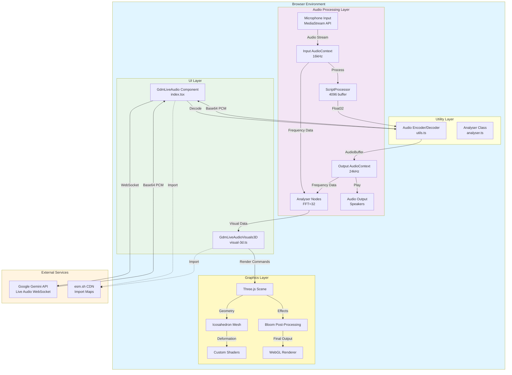
```mermaid
graph TB
    subgraph Browser["Browser Environment"]
        subgraph UI["UI Layer"]
            GLA[GdmLiveAudio Component<br/>index.tsx]
            VIS3D[GdmLiveAudioVisuals3D<br/>visual-3d.ts]
        end

        subgraph Audio["Audio Processing Layer"]
            MIC[Microphone Input<br/>MediaStream API]
            INPUT_CTX[Input AudioContext<br/>16kHz]
            OUTPUT_CTX[Output AudioContext<br/>24kHz]
            PROC[ScriptProcessor<br/>4096 buffer]
            ANALYSER[Analyser Nodes<br/>FFT=32]
            SPEAKERS[Audio Output<br/>Speakers]
        end

        subgraph Graphics["Graphics Layer"]
            SCENE[Three.js Scene]
            SPHERE[Icosahedron Mesh]
            SHADER[Custom Shaders]
            BLOOM[Bloom Post-Processing]
            RENDERER[WebGL Renderer]
        end

        subgraph Utils["Utility Layer"]
            ENCODER[Audio Encoder/Decoder<br/>utils.ts]
            ANALYSER_CLASS[Analyser Class<br/>analyser.ts]
        end
    end

    subgraph External["External Services"]
        GEMINI[Google Gemini API<br/>Live Audio WebSocket]
        CDN[esm.sh CDN<br/>Import Maps]
    end

    MIC -->|Audio Stream| INPUT_CTX
    INPUT_CTX -->|Process| PROC
    PROC -->|Float32| ENCODER
    ENCODER -->|Base64 PCM| GLA
    GLA -->|WebSocket| GEMINI

    GEMINI -->|Base64 PCM| GLA
    GLA -->|Decode| ENCODER
    ENCODER -->|AudioBuffer| OUTPUT_CTX
    OUTPUT_CTX -->|Play| SPEAKERS

    INPUT_CTX -->|Frequency Data| ANALYSER
    OUTPUT_CTX -->|Frequency Data| ANALYSER
    ANALYSER -->|Visual Data| VIS3D

    VIS3D -->|Render Commands| SCENE
    SCENE -->|Geometry| SPHERE
    SPHERE -->|Deformation| SHADER
    SCENE -->|Effects| BLOOM
    BLOOM -->|Final Output| RENDERER

    GLA -.->|Import| CDN
    VIS3D -.->|Import| CDN

    style Browser fill:#e1f5ff
    style External fill:#fff4e1
    style UI fill:#e8f5e9
    style Audio fill:#f3e5f5
    style Graphics fill:#fff9c4
```

### Component Architecture

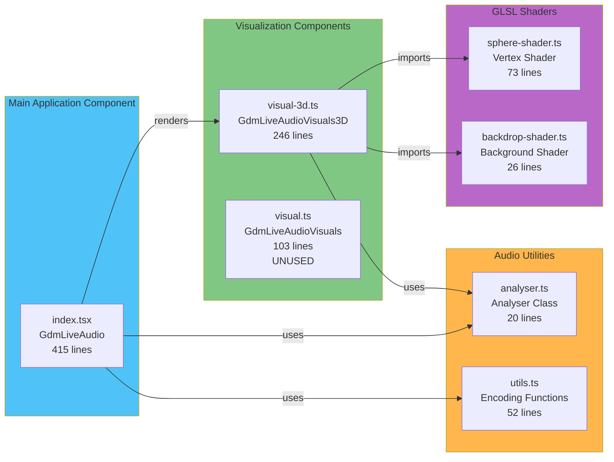
```mermaid
graph LR
    subgraph Main["Main Application Component"]
        IndexTSX[index.tsx<br/>GdmLiveAudio<br/>415 lines]
    end

    subgraph Visual["Visualization Components"]
        Visual3D[visual-3d.ts<br/>GdmLiveAudioVisuals3D<br/>246 lines]
        Visual2D[visual.ts<br/>GdmLiveAudioVisuals<br/>103 lines<br/>UNUSED]
    end

    subgraph AudioUtils["Audio Utilities"]
        Analyser[analyser.ts<br/>Analyser Class<br/>20 lines]
        Utils[utils.ts<br/>Encoding Functions<br/>52 lines]
    end

    subgraph Shaders["GLSL Shaders"]
        SphereShader[sphere-shader.ts<br/>Vertex Shader<br/>73 lines]
        BackdropShader[backdrop-shader.ts<br/>Background Shader<br/>26 lines]
    end

    IndexTSX -->|renders| Visual3D
    IndexTSX -->|uses| Analyser
    IndexTSX -->|uses| Utils
    Visual3D -->|uses| Analyser
    Visual3D -->|imports| SphereShader
    Visual3D -->|imports| BackdropShader

    style Main fill:#4fc3f7
    style Visual fill:#81c784
    style AudioUtils fill:#ffb74d
    style Shaders fill:#ba68c8
```

---

## Component Diagrams

### Main Application Component (index.tsx)

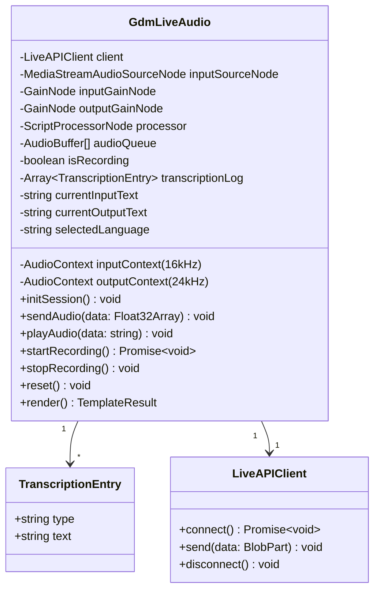
```mermaid
classDiagram
    class GdmLiveAudio {
        -LiveAPIClient client
        -AudioContext inputContext (16kHz)
        -AudioContext outputContext (24kHz)
        -MediaStreamAudioSourceNode inputSourceNode
        -GainNode inputGainNode
        -GainNode outputGainNode
        -ScriptProcessorNode processor
        -AudioBuffer[] audioQueue
        -boolean isRecording
        -Array~TranscriptionEntry~ transcriptionLog
        -string currentInputText
        -string currentOutputText
        -string selectedLanguage

        +initSession() void
        +sendAudio(data: Float32Array) void
        +playAudio(data: string) void
        +startRecording() Promise~void~
        +stopRecording() void
        +reset() void
        +render() TemplateResult
    }

    class TranscriptionEntry {
        +string type
        +string text
    }

    class LiveAPIClient {
        +connect() Promise~void~
        +send(data: BlobPart) void
        +disconnect() void
    }

    GdmLiveAudio "1" --> "*" TranscriptionEntry
    GdmLiveAudio "1" --> "1" LiveAPIClient
```

### 3D Visualization Component (visual-3d.ts)

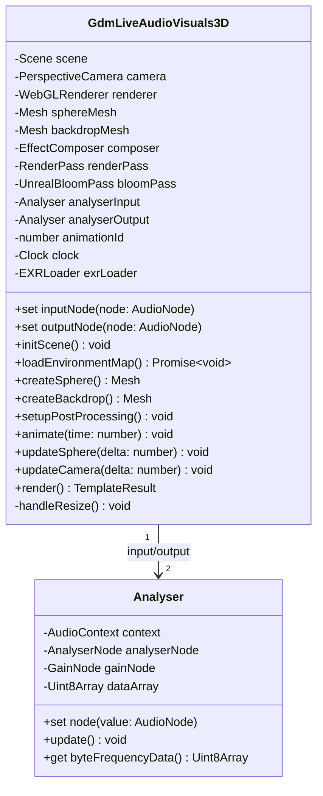
```mermaid
classDiagram
    class GdmLiveAudioVisuals3D {
        -Scene scene
        -PerspectiveCamera camera
        -WebGLRenderer renderer
        -Mesh sphereMesh
        -Mesh backdropMesh
        -EffectComposer composer
        -RenderPass renderPass
        -UnrealBloomPass bloomPass
        -Analyser analyserInput
        -Analyser analyserOutput
        -number animationId
        -Clock clock
        -EXRLoader exrLoader

        +set inputNode(node: AudioNode)
        +set outputNode(node: AudioNode)
        +initScene() void
        +loadEnvironmentMap() Promise~void~
        +createSphere() Mesh
        +createBackdrop() Mesh
        +setupPostProcessing() void
        +animate(time: number) void
        +updateSphere(delta: number) void
        +updateCamera(delta: number) void
        +render() TemplateResult
        -handleResize() void
    }

    class Analyser {
        -AudioContext context
        -AnalyserNode analyserNode
        -GainNode gainNode
        -Uint8Array dataArray

        +set node(value: AudioNode)
        +update() void
        +get byteFrequencyData() Uint8Array
    }

    GdmLiveAudioVisuals3D "1" --> "2" Analyser : input/output
```

### Audio Utility Functions

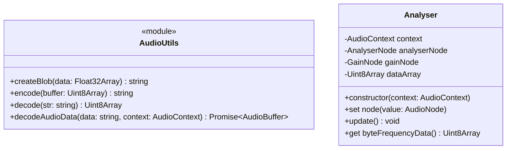
```mermaid
classDiagram
    class AudioUtils {
        <<module>>
        +createBlob(data: Float32Array) string
        +encode(buffer: Uint8Array) string
        +decode(str: string) Uint8Array
        +decodeAudioData(data: string, context: AudioContext) Promise~AudioBuffer~
    }

    class Analyser {
        -AudioContext context
        -AnalyserNode analyserNode
        -GainNode gainNode
        -Uint8Array dataArray

        +constructor(context: AudioContext)
        +set node(value: AudioNode)
        +update() void
        +get byteFrequencyData() Uint8Array
    }
```

---

## Sequence Diagrams

### 1. Application Startup and Initialization

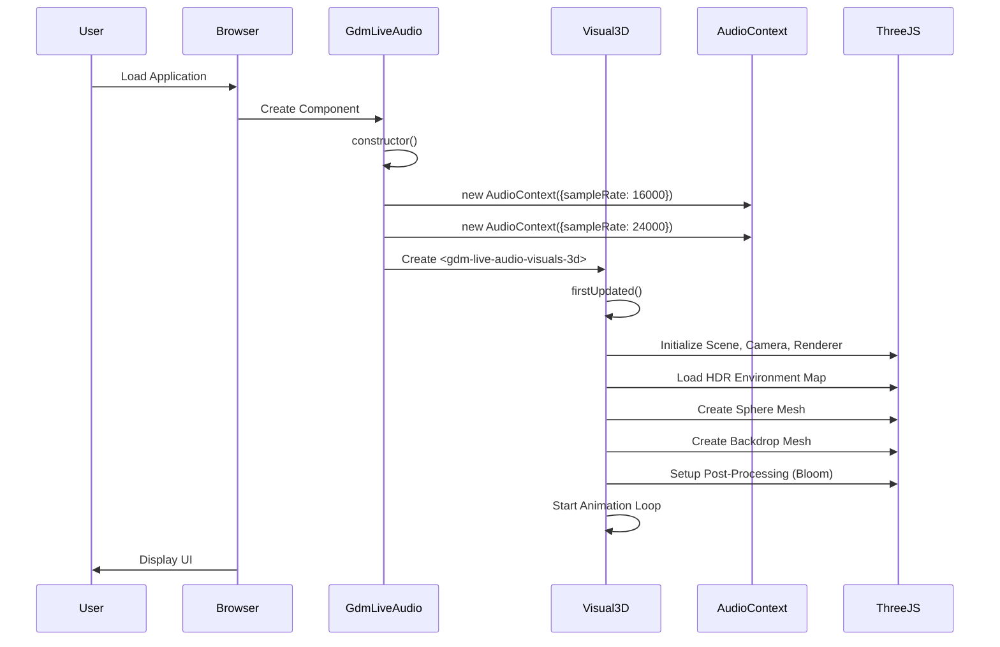
```mermaid
sequenceDiagram
    participant User
    participant Browser
    participant GdmLiveAudio
    participant Visual3D
    participant AudioContext
    participant ThreeJS

    User->>Browser: Load Application
    Browser->>GdmLiveAudio: Create Component
    GdmLiveAudio->>GdmLiveAudio: constructor()
    GdmLiveAudio->>AudioContext: new AudioContext({sampleRate: 16000})
    GdmLiveAudio->>AudioContext: new AudioContext({sampleRate: 24000})
    GdmLiveAudio->>Visual3D: Create <gdm-live-audio-visuals-3d>
    Visual3D->>Visual3D: firstUpdated()
    Visual3D->>ThreeJS: Initialize Scene, Camera, Renderer
    Visual3D->>ThreeJS: Load HDR Environment Map
    Visual3D->>ThreeJS: Create Sphere Mesh
    Visual3D->>ThreeJS: Create Backdrop Mesh
    Visual3D->>ThreeJS: Setup Post-Processing (Bloom)
    Visual3D->>Visual3D: Start Animation Loop
    Browser->>User: Display UI
```

### 2. Start Recording and Gemini Session

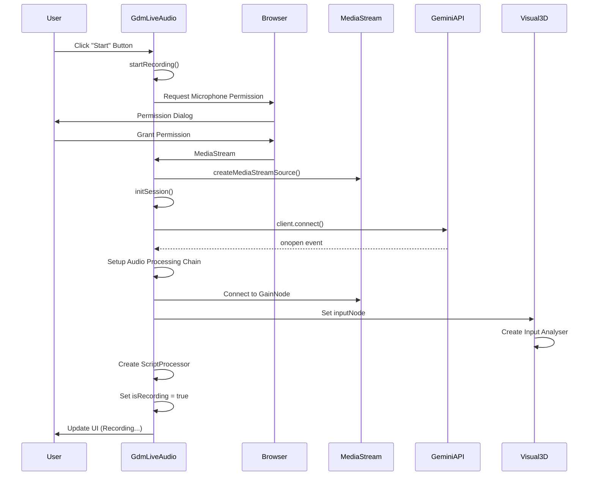
```mermaid
sequenceDiagram
    participant User
    participant GdmLiveAudio
    participant Browser
    participant MediaStream
    participant GeminiAPI
    participant Visual3D

    User->>GdmLiveAudio: Click "Start" Button
    GdmLiveAudio->>GdmLiveAudio: startRecording()
    GdmLiveAudio->>Browser: Request Microphone Permission
    Browser->>User: Permission Dialog
    User->>Browser: Grant Permission
    Browser->>GdmLiveAudio: MediaStream
    GdmLiveAudio->>MediaStream: createMediaStreamSource()
    GdmLiveAudio->>GdmLiveAudio: initSession()
    GdmLiveAudio->>GeminiAPI: client.connect()
    GeminiAPI-->>GdmLiveAudio: onopen event
    GdmLiveAudio->>GdmLiveAudio: Setup Audio Processing Chain
    GdmLiveAudio->>MediaStream: Connect to GainNode
    GdmLiveAudio->>Visual3D: Set inputNode
    Visual3D->>Visual3D: Create Input Analyser
    GdmLiveAudio->>GdmLiveAudio: Create ScriptProcessor
    GdmLiveAudio->>GdmLiveAudio: Set isRecording = true
    GdmLiveAudio->>User: Update UI (Recording...)
```

### 3. Audio Input Processing and Sending to Gemini

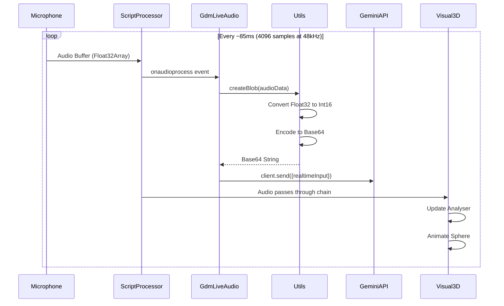
```mermaid
sequenceDiagram
    participant Microphone
    participant ScriptProcessor
    participant GdmLiveAudio
    participant Utils
    participant GeminiAPI
    participant Visual3D

    loop Every ~85ms (4096 samples at 48kHz)
        Microphone->>ScriptProcessor: Audio Buffer (Float32Array)
        ScriptProcessor->>GdmLiveAudio: onaudioprocess event
        GdmLiveAudio->>Utils: createBlob(audioData)
        Utils->>Utils: Convert Float32 to Int16
        Utils->>Utils: Encode to Base64
        Utils-->>GdmLiveAudio: Base64 String
        GdmLiveAudio->>GeminiAPI: client.send({realtimeInput})
        ScriptProcessor->>Visual3D: Audio passes through chain
        Visual3D->>Visual3D: Update Analyser
        Visual3D->>Visual3D: Animate Sphere
    end
```

### 4. Receiving and Playing Gemini Audio Response

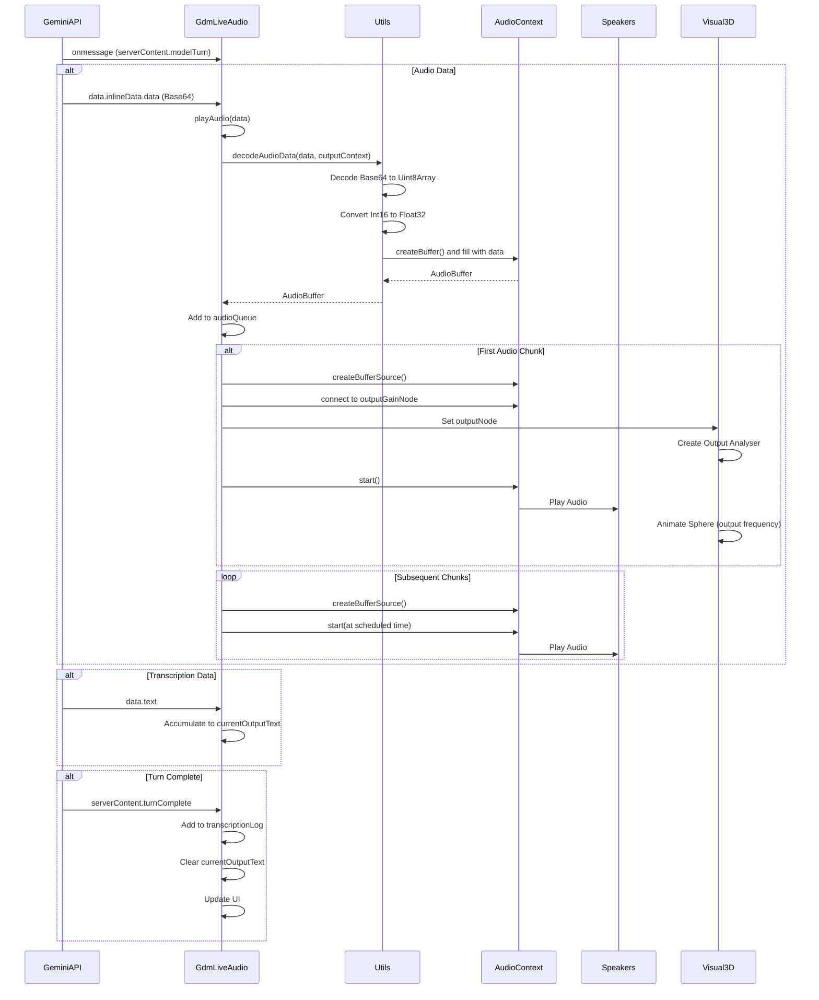
```mermaid
sequenceDiagram
    participant GeminiAPI
    participant GdmLiveAudio
    participant Utils
    participant AudioContext
    participant Speakers
    participant Visual3D

    GeminiAPI->>GdmLiveAudio: onmessage (serverContent.modelTurn)

    alt Audio Data
        GeminiAPI->>GdmLiveAudio: data.inlineData.data (Base64)
        GdmLiveAudio->>GdmLiveAudio: playAudio(data)
        GdmLiveAudio->>Utils: decodeAudioData(data, outputContext)
        Utils->>Utils: Decode Base64 to Uint8Array
        Utils->>Utils: Convert Int16 to Float32
        Utils->>AudioContext: createBuffer() and fill with data
        AudioContext-->>Utils: AudioBuffer
        Utils-->>GdmLiveAudio: AudioBuffer
        GdmLiveAudio->>GdmLiveAudio: Add to audioQueue

        alt First Audio Chunk
            GdmLiveAudio->>AudioContext: createBufferSource()
            GdmLiveAudio->>AudioContext: connect to outputGainNode
            GdmLiveAudio->>Visual3D: Set outputNode
            Visual3D->>Visual3D: Create Output Analyser
            GdmLiveAudio->>AudioContext: start()
            AudioContext->>Speakers: Play Audio
            Visual3D->>Visual3D: Animate Sphere (output frequency)
        end

        loop Subsequent Chunks
            GdmLiveAudio->>AudioContext: createBufferSource()
            GdmLiveAudio->>AudioContext: start(at scheduled time)
            AudioContext->>Speakers: Play Audio
        end
    end

    alt Transcription Data
        GeminiAPI->>GdmLiveAudio: data.text
        GdmLiveAudio->>GdmLiveAudio: Accumulate to currentOutputText
    end

    alt Turn Complete
        GeminiAPI->>GdmLiveAudio: serverContent.turnComplete
        GdmLiveAudio->>GdmLiveAudio: Add to transcriptionLog
        GdmLiveAudio->>GdmLiveAudio: Clear currentOutputText
        GdmLiveAudio->>GdmLiveAudio: Update UI
    end
```

### 5. Real-time 3D Visualization Update

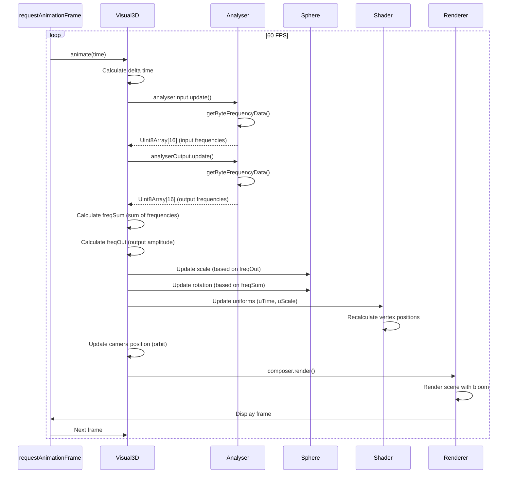
```mermaid
sequenceDiagram
    participant RAF as requestAnimationFrame
    participant Visual3D
    participant Analyser
    participant Sphere
    participant Shader
    participant Renderer

    loop 60 FPS
        RAF->>Visual3D: animate(time)
        Visual3D->>Visual3D: Calculate delta time

        Visual3D->>Analyser: analyserInput.update()
        Analyser->>Analyser: getByteFrequencyData()
        Analyser-->>Visual3D: Uint8Array[16] (input frequencies)

        Visual3D->>Analyser: analyserOutput.update()
        Analyser->>Analyser: getByteFrequencyData()
        Analyser-->>Visual3D: Uint8Array[16] (output frequencies)

        Visual3D->>Visual3D: Calculate freqSum (sum of frequencies)
        Visual3D->>Visual3D: Calculate freqOut (output amplitude)

        Visual3D->>Sphere: Update scale (based on freqOut)
        Visual3D->>Sphere: Update rotation (based on freqSum)

        Visual3D->>Shader: Update uniforms (uTime, uScale)
        Shader->>Shader: Recalculate vertex positions

        Visual3D->>Visual3D: Update camera position (orbit)

        Visual3D->>Renderer: composer.render()
        Renderer->>Renderer: Render scene with bloom
        Renderer->>RAF: Display frame

        RAF->>Visual3D: Next frame
    end
```

### 6. Stop Recording and Cleanup

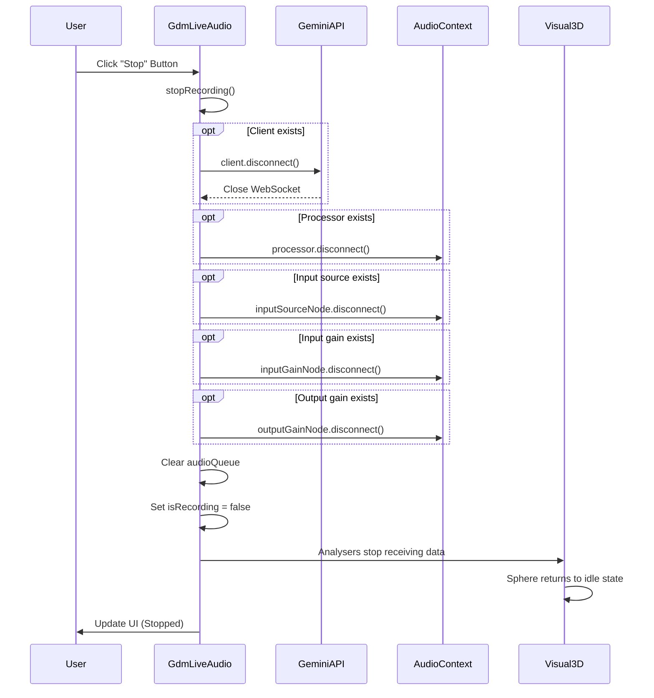
```mermaid
sequenceDiagram
    participant User
    participant GdmLiveAudio
    participant GeminiAPI
    participant AudioContext
    participant Visual3D

    User->>GdmLiveAudio: Click "Stop" Button
    GdmLiveAudio->>GdmLiveAudio: stopRecording()

    opt Client exists
        GdmLiveAudio->>GeminiAPI: client.disconnect()
        GeminiAPI-->>GdmLiveAudio: Close WebSocket
    end

    opt Processor exists
        GdmLiveAudio->>AudioContext: processor.disconnect()
    end

    opt Input source exists
        GdmLiveAudio->>AudioContext: inputSourceNode.disconnect()
    end

    opt Input gain exists
        GdmLiveAudio->>AudioContext: inputGainNode.disconnect()
    end

    opt Output gain exists
        GdmLiveAudio->>AudioContext: outputGainNode.disconnect()
    end

    GdmLiveAudio->>GdmLiveAudio: Clear audioQueue
    GdmLiveAudio->>GdmLiveAudio: Set isRecording = false
    GdmLiveAudio->>Visual3D: Analysers stop receiving data
    Visual3D->>Visual3D: Sphere returns to idle state
    GdmLiveAudio->>User: Update UI (Stopped)
```

### 7. Language Selection and Translation

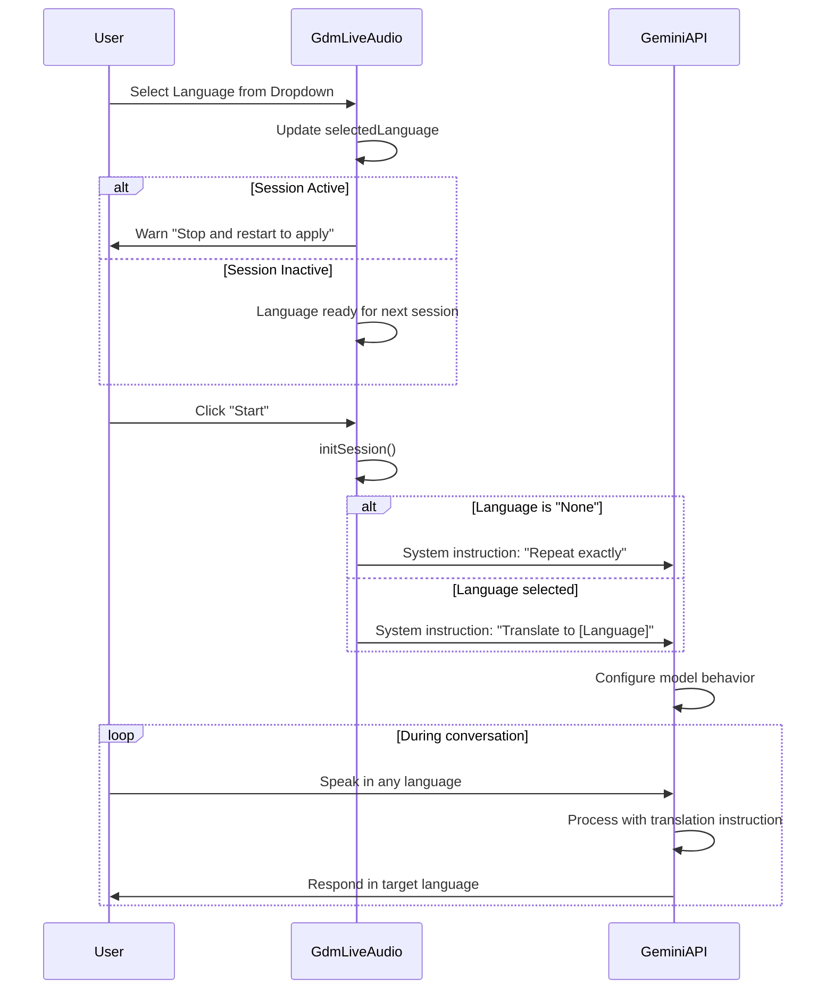
```mermaid
sequenceDiagram
    participant User
    participant GdmLiveAudio
    participant GeminiAPI

    User->>GdmLiveAudio: Select Language from Dropdown
    GdmLiveAudio->>GdmLiveAudio: Update selectedLanguage

    alt Session Active
        GdmLiveAudio->>User: Warn "Stop and restart to apply"
    else Session Inactive
        GdmLiveAudio->>GdmLiveAudio: Language ready for next session
    end

    User->>GdmLiveAudio: Click "Start"
    GdmLiveAudio->>GdmLiveAudio: initSession()

    alt Language is "None"
        GdmLiveAudio->>GeminiAPI: System instruction: "Repeat exactly"
    else Language selected
        GdmLiveAudio->>GeminiAPI: System instruction: "Translate to [Language]"
    end

    GeminiAPI->>GeminiAPI: Configure model behavior

    loop During conversation
        User->>GeminiAPI: Speak in any language
        GeminiAPI->>GeminiAPI: Process with translation instruction
        GeminiAPI->>User: Respond in target language
    end
```

---

## Class Diagrams

### Complete Type System

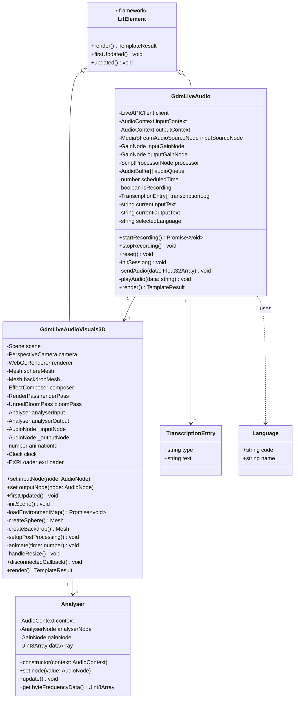
```mermaid
classDiagram
    class LitElement {
        <<framework>>
        +render() TemplateResult
        +firstUpdated() void
        +updated() void
    }

    class GdmLiveAudio {
        -LiveAPIClient client
        -AudioContext inputContext
        -AudioContext outputContext
        -MediaStreamAudioSourceNode inputSourceNode
        -GainNode inputGainNode
        -GainNode outputGainNode
        -ScriptProcessorNode processor
        -AudioBuffer[] audioQueue
        -number scheduledTime
        -boolean isRecording
        -TranscriptionEntry[] transcriptionLog
        -string currentInputText
        -string currentOutputText
        -string selectedLanguage

        +startRecording() Promise~void~
        +stopRecording() void
        +reset() void
        -initSession() void
        -sendAudio(data: Float32Array) void
        -playAudio(data: string) void
        +render() TemplateResult
    }

    class GdmLiveAudioVisuals3D {
        -Scene scene
        -PerspectiveCamera camera
        -WebGLRenderer renderer
        -Mesh sphereMesh
        -Mesh backdropMesh
        -EffectComposer composer
        -RenderPass renderPass
        -UnrealBloomPass bloomPass
        -Analyser analyserInput
        -Analyser analyserOutput
        -AudioNode _inputNode
        -AudioNode _outputNode
        -number animationId
        -Clock clock
        -EXRLoader exrLoader

        +set inputNode(node: AudioNode)
        +set outputNode(node: AudioNode)
        +firstUpdated() void
        -initScene() void
        -loadEnvironmentMap() Promise~void~
        -createSphere() Mesh
        -createBackdrop() Mesh
        -setupPostProcessing() void
        -animate(time: number) void
        -handleResize() void
        +disconnectedCallback() void
        +render() TemplateResult
    }

    class Analyser {
        -AudioContext context
        -AnalyserNode analyserNode
        -GainNode gainNode
        -Uint8Array dataArray

        +constructor(context: AudioContext)
        +set node(value: AudioNode)
        +update() void
        +get byteFrequencyData() Uint8Array
    }

    class TranscriptionEntry {
        +string type
        +string text
    }

    class Language {
        +string code
        +string name
    }

    LitElement <|-- GdmLiveAudio
    LitElement <|-- GdmLiveAudioVisuals3D
    GdmLiveAudio "1" --> "*" TranscriptionEntry
    GdmLiveAudio "1" --> "1" GdmLiveAudioVisuals3D
    GdmLiveAudioVisuals3D "1" --> "2" Analyser
    GdmLiveAudio ..> Language : uses
```

### Audio Processing Chain

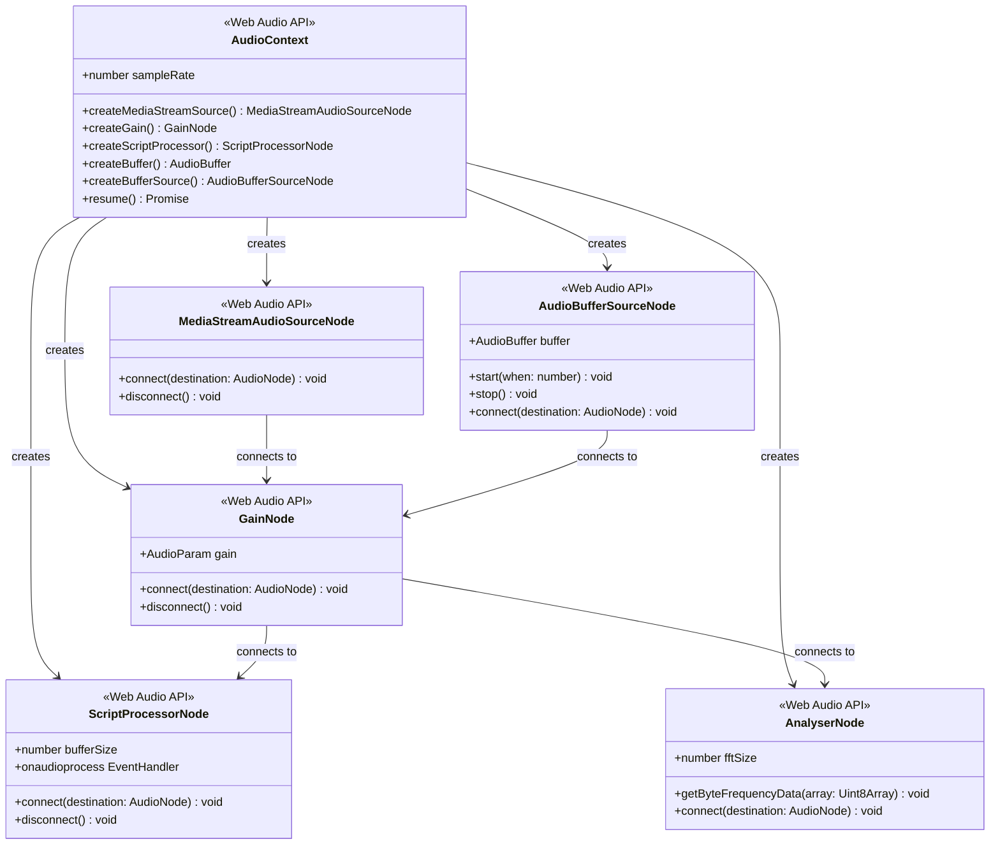
```mermaid
classDiagram
    class AudioContext {
        <<Web Audio API>>
        +number sampleRate
        +createMediaStreamSource() MediaStreamAudioSourceNode
        +createGain() GainNode
        +createScriptProcessor() ScriptProcessorNode
        +createBuffer() AudioBuffer
        +createBufferSource() AudioBufferSourceNode
        +resume() Promise
    }

    class MediaStreamAudioSourceNode {
        <<Web Audio API>>
        +connect(destination: AudioNode) void
        +disconnect() void
    }

    class GainNode {
        <<Web Audio API>>
        +AudioParam gain
        +connect(destination: AudioNode) void
        +disconnect() void
    }

    class ScriptProcessorNode {
        <<Web Audio API>>
        +number bufferSize
        +onaudioprocess EventHandler
        +connect(destination: AudioNode) void
        +disconnect() void
    }

    class AnalyserNode {
        <<Web Audio API>>
        +number fftSize
        +getByteFrequencyData(array: Uint8Array) void
        +connect(destination: AudioNode) void
    }

    class AudioBufferSourceNode {
        <<Web Audio API>>
        +AudioBuffer buffer
        +start(when: number) void
        +stop() void
        +connect(destination: AudioNode) void
    }

    AudioContext --> MediaStreamAudioSourceNode : creates
    AudioContext --> GainNode : creates
    AudioContext --> ScriptProcessorNode : creates
    AudioContext --> AnalyserNode : creates
    AudioContext --> AudioBufferSourceNode : creates

    MediaStreamAudioSourceNode --> GainNode : connects to
    GainNode --> ScriptProcessorNode : connects to
    GainNode --> AnalyserNode : connects to
    AudioBufferSourceNode --> GainNode : connects to
```

---

## State Diagrams

### Application State Machine

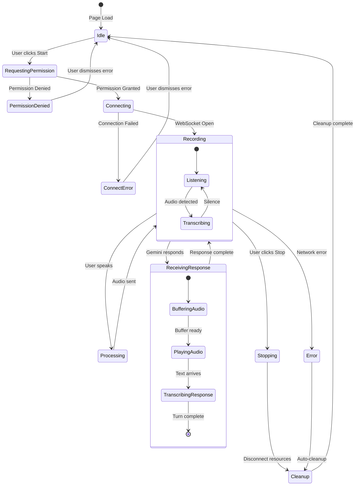
```mermaid
stateDiagram-v2
    [*] --> Idle: Page Load

    Idle --> RequestingPermission: User clicks Start
    RequestingPermission --> PermissionDenied: Permission Denied
    RequestingPermission --> Connecting: Permission Granted

    PermissionDenied --> Idle: User dismisses error

    Connecting --> ConnectError: Connection Failed
    Connecting --> Recording: WebSocket Open

    ConnectError --> Idle: User dismisses error

    Recording --> Processing: User speaks
    Processing --> Recording: Audio sent

    Recording --> ReceivingResponse: Gemini responds
    ReceivingResponse --> Recording: Response complete

    Recording --> Stopping: User clicks Stop
    Stopping --> Cleanup: Disconnect resources
    Cleanup --> Idle: Cleanup complete

    Recording --> Error: Network error
    Error --> Cleanup: Auto-cleanup

    state Recording {
        [*] --> Listening
        Listening --> Transcribing: Audio detected
        Transcribing --> Listening: Silence
    }

    state ReceivingResponse {
        [*] --> BufferingAudio
        BufferingAudio --> PlayingAudio: Buffer ready
        PlayingAudio --> TranscribingResponse: Text arrives
        TranscribingResponse --> [*]: Turn complete
    }
```

### 3D Visualization State

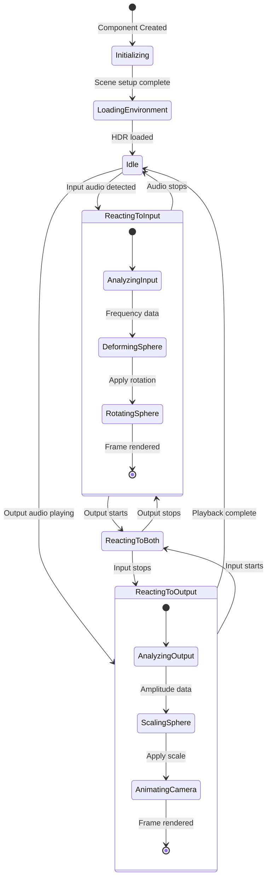
```mermaid
stateDiagram-v2
    [*] --> Initializing: Component Created

    Initializing --> LoadingEnvironment: Scene setup complete
    LoadingEnvironment --> Idle: HDR loaded

    Idle --> ReactingToInput: Input audio detected
    ReactingToInput --> Idle: Audio stops

    Idle --> ReactingToOutput: Output audio playing
    ReactingToOutput --> Idle: Playback complete

    ReactingToInput --> ReactingToBoth: Output starts
    ReactingToOutput --> ReactingToBoth: Input starts
    ReactingToBoth --> ReactingToInput: Output stops
    ReactingToBoth --> ReactingToOutput: Input stops

    state ReactingToInput {
        [*] --> AnalyzingInput
        AnalyzingInput --> DeformingSphere: Frequency data
        DeformingSphere --> RotatingSphere: Apply rotation
        RotatingSphere --> [*]: Frame rendered
    }

    state ReactingToOutput {
        [*] --> AnalyzingOutput
        AnalyzingOutput --> ScalingSphere: Amplitude data
        ScalingSphere --> AnimatingCamera: Apply scale
        AnimatingCamera --> [*]: Frame rendered
    }
```

### Audio Buffer Queue State

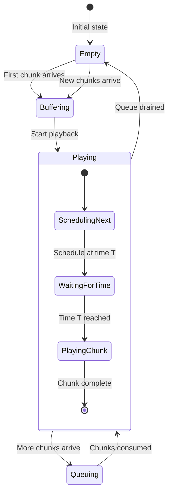
```mermaid
stateDiagram-v2
    [*] --> Empty: Initial state

    Empty --> Buffering: First chunk arrives
    Buffering --> Playing: Start playback

    Playing --> Queuing: More chunks arrive
    Queuing --> Playing: Chunks consumed

    Playing --> Empty: Queue drained
    Empty --> Buffering: New chunks arrive

    state Playing {
        [*] --> SchedulingNext
        SchedulingNext --> WaitingForTime: Schedule at time T
        WaitingForTime --> PlayingChunk: Time T reached
        PlayingChunk --> [*]: Chunk complete
    }
```

---

## Data Flow

### Audio Data Flow

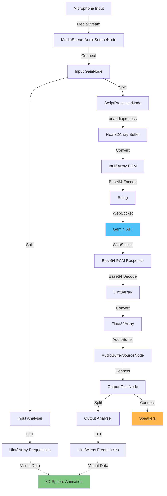
```mermaid
flowchart TD
    A[Microphone Input] -->|MediaStream| B[MediaStreamAudioSourceNode]
    B -->|Connect| C[Input GainNode]
    C -->|Split| D[ScriptProcessorNode]
    C -->|Split| E[Input Analyser]

    D -->|onaudioprocess| F[Float32Array Buffer]
    F -->|Convert| G[Int16Array PCM]
    G -->|Base64 Encode| H[String]
    H -->|WebSocket| I[Gemini API]

    E -->|FFT| J[Uint8Array Frequencies]
    J -->|Visual Data| K[3D Sphere Animation]

    I -->|WebSocket| L[Base64 PCM Response]
    L -->|Base64 Decode| M[Uint8Array]
    M -->|Convert| N[Float32Array]
    N -->|AudioBuffer| O[AudioBufferSourceNode]

    O -->|Connect| P[Output GainNode]
    P -->|Split| Q[Output Analyser]
    P -->|Connect| R[Speakers]

    Q -->|FFT| S[Uint8Array Frequencies]
    S -->|Visual Data| K

    style I fill:#4fc3f7
    style K fill:#81c784
    style R fill:#ffb74d
```

### Transcription Data Flow

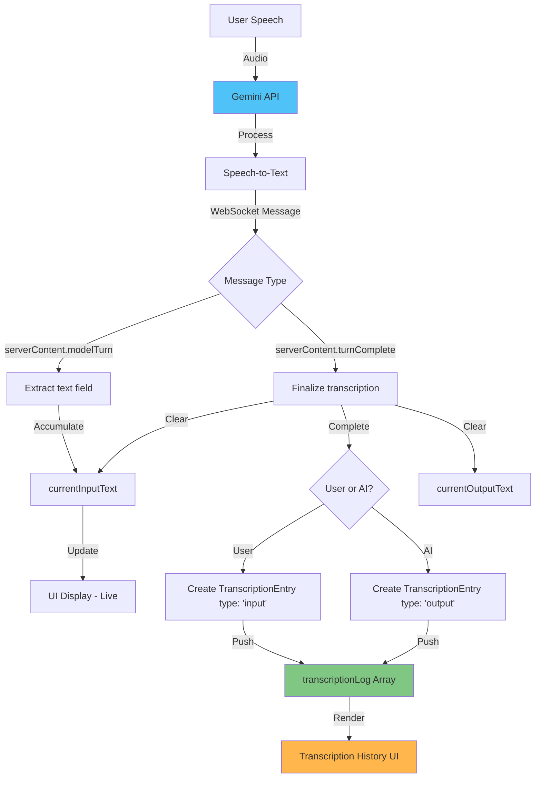
```mermaid
flowchart TD
    A[User Speech] -->|Audio| B[Gemini API]
    B -->|Process| C[Speech-to-Text]
    C -->|WebSocket Message| D{Message Type}

    D -->|serverContent.modelTurn| E[Extract text field]
    D -->|serverContent.turnComplete| F[Finalize transcription]

    E -->|Accumulate| G[currentInputText]
    G -->|Update| H[UI Display - Live]

    F -->|Complete| I{User or AI?}
    I -->|User| J[Create TranscriptionEntry type: 'input']
    I -->|AI| K[Create TranscriptionEntry type: 'output']

    J -->|Push| L[transcriptionLog Array]
    K -->|Push| L

    L -->|Render| M[Transcription History UI]

    F -->|Clear| G
    F -->|Clear| N[currentOutputText]

    style B fill:#4fc3f7
    style L fill:#81c784
    style M fill:#ffb74d
```

### 3D Rendering Pipeline

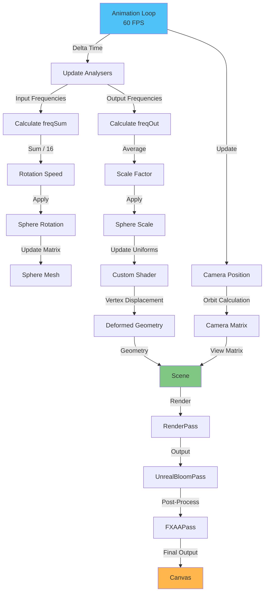
```mermaid
flowchart TD
    A[Animation Loop<br/>60 FPS] -->|Delta Time| B[Update Analysers]

    B -->|Input Frequencies| C[Calculate freqSum]
    B -->|Output Frequencies| D[Calculate freqOut]

    C -->|Sum / 16| E[Rotation Speed]
    D -->|Average| F[Scale Factor]

    E -->|Apply| G[Sphere Rotation]
    F -->|Apply| H[Sphere Scale]

    G -->|Update Matrix| I[Sphere Mesh]
    H -->|Update Uniforms| J[Custom Shader]

    J -->|Vertex Displacement| K[Deformed Geometry]

    A -->|Update| L[Camera Position]
    L -->|Orbit Calculation| M[Camera Matrix]

    K -->|Geometry| N[Scene]
    M -->|View Matrix| N

    N -->|Render| O[RenderPass]
    O -->|Output| P[UnrealBloomPass]
    P -->|Post-Process| Q[FXAAPass]
    Q -->|Final Output| R[Canvas]

    style A fill:#4fc3f7
    style N fill:#81c784
    style R fill:#ffb74d
```

---

## API Specifications

### Gemini Live Audio API

#### Connection

```typescript
// Endpoint
wss://generativelanguage.googleapis.com/v1beta/models/gemini-2.5-flash-native-audio-preview-09-2025:liveConnect

// Authentication
?key=${API_KEY}
```

#### Configuration

```typescript
interface LiveConfig {
  model: string;  // "gemini-2.5-flash-native-audio-preview-09-2025"
  generationConfig: {
    responseModalities: "audio";
    speechConfig: {
      voiceConfig: {
        prebuiltVoiceConfig: {
          voiceName: "Aoede";  // Voice selection
        }
      }
    }
  };
  systemInstruction?: {
    parts: Array<{ text: string }>;
  };
}
```

#### Message Types

**Send Audio Input**:
```typescript
{
  realtimeInput: {
    mediaChunks: [
      {
        mimeType: "audio/pcm;rate=16000",
        data: string  // Base64-encoded 16-bit PCM
      }
    ]
  }
}
```

**Receive Audio Output**:
```typescript
{
  serverContent: {
    modelTurn: {
      parts: [
        {
          inlineData: {
            mimeType: "audio/pcm;rate=24000",
            data: string  // Base64-encoded 16-bit PCM
          }
        }
      ]
    }
  }
}
```

**Receive Transcription**:
```typescript
{
  serverContent: {
    modelTurn: {
      parts: [
        {
          text: string  // Transcription text
        }
      ]
    }
  }
}
```

**Turn Complete**:
```typescript
{
  serverContent: {
    turnComplete: true
  }
}
```

### Web Audio API Usage

#### Input Audio Chain

```typescript
// Context: 16kHz (Gemini requirement)
inputContext = new AudioContext({ sampleRate: 16000 });

// Chain: Microphone → Source → Gain → Processor → (WebSocket)
//                                    ↘ Analyser → (Visualization)

navigator.mediaDevices.getUserMedia({ audio: true })
  .then(stream => {
    inputSourceNode = inputContext.createMediaStreamSource(stream);
    inputGainNode = inputContext.createGain();
    processor = inputContext.createScriptProcessor(4096, 1, 1);

    inputSourceNode.connect(inputGainNode);
    inputGainNode.connect(processor);
    processor.connect(inputContext.destination);

    // For visualization
    const analyser = new Analyser(inputContext);
    analyser.node = inputGainNode;
  });
```

#### Output Audio Chain

```typescript
// Context: 24kHz (Gemini output format)
outputContext = new AudioContext({ sampleRate: 24000 });

// Chain: AudioBuffer → BufferSource → Gain → Destination (Speakers)
//                                          ↘ Analyser → (Visualization)

const audioBuffer = await decodeAudioData(base64Data, outputContext);
const source = outputContext.createBufferSource();
source.buffer = audioBuffer;

outputGainNode = outputContext.createGain();
source.connect(outputGainNode);
outputGainNode.connect(outputContext.destination);

// For visualization
const analyser = new Analyser(outputContext);
analyser.node = outputGainNode;

source.start(scheduledTime);
```

### Three.js Scene Graph

```
Scene
├── PerspectiveCamera (FOV: 75, Aspect: auto, Near: 0.1, Far: 1000)
│   └── Position: (0, 0, 5) → Animated orbit
│
├── Sphere Mesh
│   ├── Geometry: IcosahedronGeometry(radius: 1, detail: 5)
│   ├── Material: MeshStandardMaterial
│   │   ├── Color: 0x4fc3f7
│   │   ├── Metalness: 0.8
│   │   ├── Roughness: 0.2
│   │   ├── envMapIntensity: 1.5
│   │   └── Custom Shader Injection (onBeforeCompile)
│   └── Scale/Rotation: Audio-reactive
│
├── Backdrop Mesh
│   ├── Geometry: PlaneGeometry(20, 20)
│   ├── Material: ShaderMaterial (Custom gradient)
│   └── Position: (0, 0, -5)
│
└── Environment Map: HDR (piz_compressed.exr)

Post-Processing:
EffectComposer
├── RenderPass (scene, camera)
├── UnrealBloomPass (strength: 1.5, radius: 0.4, threshold: 0.85)
└── Output to Canvas
```

---

## Performance Requirements

### Audio Processing

| Metric | Requirement | Notes |
|--------|-------------|-------|
| Audio Latency | < 100ms | Round-trip (input → Gemini → output) |
| Buffer Size | 4096 samples | ~85ms at 48kHz native rate |
| Input Sample Rate | 16kHz | Gemini API requirement (non-configurable) |
| Output Sample Rate | 24kHz | Gemini API output (non-configurable) |
| FFT Size | 32 | Results in 16 frequency bins |
| Processing Time | < 10ms | Per audio buffer callback |

### 3D Rendering

| Metric | Requirement | Notes |
|--------|-------------|-------|
| Frame Rate | 60 FPS target | May drop on low-end devices |
| Resolution | Dynamic | Matches window size with DPR |
| Sphere Vertices | ~10,242 | IcosahedronGeometry detail 5 |
| Draw Calls | ~3 per frame | Sphere, backdrop, post-processing |
| Shader Complexity | Medium | Vertex displacement + fragment lighting |
| Bloom Performance | GPU-dependent | May disable on mobile |

### Network

| Metric | Requirement | Notes |
|--------|-------------|-------|
| WebSocket Latency | < 200ms | Depends on geography and Google servers |
| Upload Rate | ~16 KB/s | 16kHz * 2 bytes/sample = 32 KB/s raw |
| Download Rate | ~24 KB/s | 24kHz * 2 bytes/sample = 48 KB/s raw |
| Connection Stability | > 99% uptime | During active session |

### Memory

| Resource | Size | Notes |
|----------|------|-------|
| HDR Environment Map | 3.3 MB | Loaded once, cached |
| Audio Queue | < 10 buffers | Each ~0.5 seconds |
| Transcription Log | < 1 MB | Typical conversation |
| Three.js Scene | ~20 MB | Including geometries and textures |
| Total Runtime | < 100 MB | Typical active session |

---

## Security Considerations

### API Key Protection

**Risk**: Exposure of `GEMINI_API_KEY` in client-side code

**Current Mitigation**:
- Stored in `.env.local` (git-ignored)
- Injected at build time by Vite
- Not committed to version control

**Recommended Production Solution**:
```typescript
// Use a backend proxy server
const proxyEndpoint = 'https://your-backend.com/api/gemini-proxy';

// Backend handles API key, adds it server-side
fetch(proxyEndpoint, {
  method: 'POST',
  body: JSON.stringify({ audio: base64Data })
});
```

### User Privacy

**Concerns**:
1. Audio is sent to Google servers
2. Transcriptions stored in browser memory
3. No local recording (but possible via DevTools)

**Mitigations**:
- Add privacy notice in UI: "Audio is processed by Google Gemini AI"
- Transcriptions cleared on page refresh
- No persistent storage (localStorage, cookies)
- HTTPS required for production (microphone access)

**Future Enhancements**:
- Optional local-only mode (no Gemini, visualization only)
- Transcription export with user consent
- Session recording opt-in

### Content Security Policy (CSP)

**Current Setup**: None

**Recommended Headers**:
```http
Content-Security-Policy:
  default-src 'self';
  script-src 'self' https://esm.sh;
  connect-src 'self' wss://generativelanguage.googleapis.com;
  style-src 'self' 'unsafe-inline';
  img-src 'self' data: blob:;
  worker-src 'self' blob:;
```

### Cross-Origin Resource Sharing (CORS)

**Import Maps**: Uses esm.sh CDN
- Trust in third-party CDN
- Potential supply chain attack vector

**Mitigation**:
- Pin specific versions in import map
- Consider self-hosting dependencies in production
- Use Subresource Integrity (SRI) hashes

### Microphone Permission

**Browser Protection**:
- Requires HTTPS in production
- User must grant permission explicitly
- Permission can be revoked anytime

**Best Practices**:
- Clear UI indication when recording
- Easy stop button
- No background recording

---

## Deployment Considerations

### Build Process

```bash
# Development
npm run dev
# → Vite dev server on http://localhost:3000
# → Hot module replacement enabled
# → Environment variables from .env.local

# Production Build
npm run build
# → TypeScript compilation
# → Vite bundle optimization
# → Output to dist/
# → Minification and tree-shaking

# Preview Production Build
npm run preview
# → Serve dist/ directory locally
# → Test production build before deployment
```

### Environment Variables

**Required**:
```env
GEMINI_API_KEY=your_api_key_here
```

**Optional**:
```env
VITE_API_ENDPOINT=wss://custom-endpoint.com  # Override API endpoint
VITE_ENVIRONMENT=production  # Environment flag
```

**Access in Code**:
```typescript
const apiKey = import.meta.env.VITE_GEMINI_API_KEY;
```

### Browser Compatibility

| Browser | Minimum Version | Notes |
|---------|----------------|-------|
| Chrome | 91+ | Full support, recommended |
| Edge | 91+ | Chromium-based, full support |
| Safari | 14.1+ | Requires WebKit prefixes for some APIs |
| Firefox | 89+ | Full support |
| Mobile Safari | 14.5+ | Performance may vary |
| Chrome Android | 91+ | Full support on modern devices |

**Features Used**:
- ES2022 syntax (top-level await, class fields)
- Web Components (custom elements)
- Web Audio API (ScriptProcessorNode - deprecated but supported)
- WebGL 2.0
- WebSocket
- MediaStream API

### AI Studio Deployment

The application is designed for AI Studio:
- View: https://ai.studio/apps/drive/1GB_xnD6NSdY0QfcD1vAVVYgg2gX_oKwP
- Uses browser-native import maps for dependencies
- `metadata.json` specifies required permissions:
  ```json
  {
    "permissions": [
      "microphone",
      "webgl"
    ]
  }
  ```

---

## Future Enhancements

### Planned Features

1. **AudioWorklet Migration**
   - Replace deprecated `ScriptProcessorNode`
   - Better performance and lower latency
   - More efficient audio processing

2. **Mobile Optimization**
   - Responsive UI design
   - Touch-friendly controls
   - Reduced visual effects for performance
   - Battery usage optimization

3. **Accessibility**
   - Keyboard navigation
   - Screen reader support
   - High contrast mode
   - Subtitles/captions UI

4. **Advanced Visualization**
   - Multiple visualization modes (waveform, spectrum, particles)
   - User-customizable colors and effects
   - VR/AR support

5. **Session Management**
   - Save/load conversation history
   - Export transcriptions (TXT, JSON, SRT)
   - Session replay
   - Conversation threading

6. **Enhanced Audio**
   - Noise cancellation
   - Echo cancellation
   - Audio input/output device selection
   - Volume controls

### Technical Debt

1. **Testing**
   - Add unit tests (Vitest)
   - Add E2E tests (Playwright)
   - Visual regression testing
   - Audio testing with synthetic inputs

2. **Code Quality**
   - Add ESLint configuration
   - Add Prettier for formatting
   - Type safety improvements
   - Error boundary implementation

3. **Performance**
   - Lazy loading for 3D components
   - Code splitting
   - Bundle size optimization
   - Memory leak detection

4. **Documentation**
   - API documentation (JSDoc)
   - Component storybook
   - Video tutorials
   - Architecture decision records (ADRs)

---

## Glossary

| Term | Definition |
|------|------------|
| **PCM** | Pulse Code Modulation - uncompressed audio format |
| **FFT** | Fast Fourier Transform - converts time-domain to frequency-domain |
| **WebGL** | Web Graphics Library - JavaScript API for rendering 3D graphics |
| **GLSL** | OpenGL Shading Language - programming language for shaders |
| **Analyser Node** | Web Audio API node that provides frequency/time-domain data |
| **Gain Node** | Web Audio API node that controls volume |
| **Script Processor** | Deprecated Web Audio API node for custom audio processing |
| **Bloom Effect** | Post-processing effect that creates glow around bright areas |
| **HDR** | High Dynamic Range - image format with extended brightness range |
| **EXR** | OpenEXR - HDR image file format |
| **Lit** | Lightweight web component library by Google |
| **Three.js** | JavaScript 3D graphics library |
| **Vite** | Modern frontend build tool |
| **Import Maps** | Browser feature for native ES module resolution |
| **Shadow DOM** | Encapsulated DOM tree for web components |
| **Custom Elements** | Browser API for defining new HTML tags |

---

**Document Version**: 1.0.0
**Last Updated**: November 17, 2025
**Maintained By**: Orb Development Team
**License**: Apache 2.0
